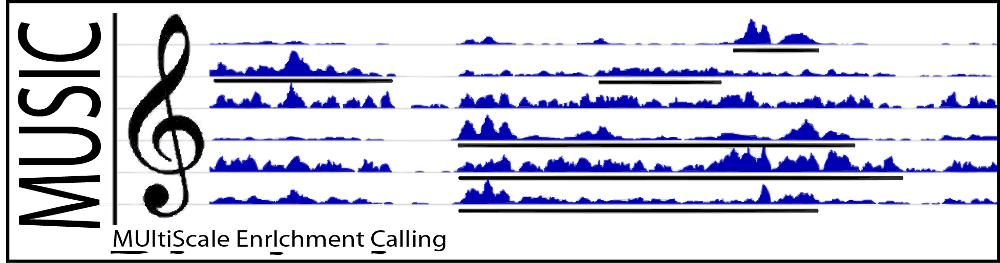

<html>

<!------------------- <title>MUSIC</title> ---->

<!-------------------<h1>MUSIC: MUltiScale enrIchment Calling</h1>---->
<!---------- MUSIC is an algorithm for identification of enriched regions at multiple scales. 
It takes as input:(1) Mapped ChIP and control reads, (2) Smoothing scale window lengths (in base pairs),  
and outputs: (1) Enriched regions at multiple scales, (2) Significantly enriched regions from all the scales. 
     ---------->
<title>MUSIC</title>
  
MUSIC is an algorithm for identification of enriched regions at multiple scales in the read depth signals from ChIP-Seq experiments. It takes as input:  

- Mapped ChIP and control reads, 
- Smoothing scale window lengths (in base pairs),

 
and outputs: 

- Enriched regions at multiple scales, 
- Significantly enriched regions from all the scales.

<!---------- <h2>Motivation: </h2>
Unlike transcription factor binding, the interpretation of enrichments in ChIP-Seq assays for diffuse binding proteins 
and histone modifications must be done --->
 
Unlike other ER identification methods, MUSIC allows analyzing the scale length spectrum of ChIP-Seq datasets and also selecting a user specific slice in the 
scale length spectrum with custom granularity and generates the enriched regions at each length scale.

<h2>Download and Installation</h2>
You can download MUSIC C++ code <a href="https://github.com/gersteinlab/MUSIC/archive/master.zip">here</a>. There are no dependencies for building MUSIC. After download, type:

<i>
unzip MUSIC.zip 
cd MUSIC 
make clean 
make
</i>

 
to build MUSIC. The executable is located under directory bin/. It may be useful to install <a href="http://samtools.sourceforge.net/">samtools</a> for processing BAM files.

To get help on which options are available, use:

MUSIC -help

<h2>Usage</h2>
MUSIC run starts with preprocessing the reads for ChIP and control samples (Note that we use samtools for converting BAM file to SAM files.):

mkdir chip;mkdir input 
samtools view chip.bam | MUSIC -preprocess SAM stdin chip/  
samtools view input.bam | MUSIC -preprocess SAM stdin input/  

 
If there are multiple replicates to be pooled, they can be done at once or separately. If done separately, MUSIC pools the reads automatically. Then it is 
necessary to sort and remove duplicate reads in control and ChIP samples:

mkdir chip/sorted;mkdir chip/dedup;mkdir input/sorted;mkdir input/dedup 
MUSIC -sort_reads chip chip/sorted  
MUSIC -sort_reads input input/sorted  
MUSIC -remove_duplicates chip/sorted 2 chip/dedup  
MUSIC -remove_duplicates input/sorted 2 input/dedup  

 
We do enriched region identification:

MUSIC -get_multiscale_broad_ERs -chip chip/dedup -control input/dedup -mapp Mappability_36bp -l_mapp 36 -begin_l 1000 -end_l 16000 -step 1.5

 
This code tells MUSIC to identify the enriched regions starting from 1kb smoothing window length upto 16kb with multiplicative factor of 1.5 using the default
parameters for the remaining parameters. The ERs for each scale are dumped. 
  
MUSIC can save the smoothed tracks in <a href="http://genome.ucsc.edu/goldenPath/help/bedgraph.html">bedGraph</a> format that can be viewed locally:

 

MUSIC -write_MS_decomposition -chip chip/dedup -control input/dedup -mapp Mappability_36bp -l_mapp 36 

 
The smoothed bedGraph files are usually very small in size and can easily be stored/transferred.

<h2>Output format</h2>
MUSIC outputs an extended BED file with 9 columns:

Column 1: [chromosome] 
Column 2: [start] 
Column 3: [end] 
Column 4: ["."] 
Column 5: [log Q-value] 
Column 6: [Strand ("+")] 
Column 7: [Summit position] 
Column 8: [Mappable Trough Position (Only for punctate ERs)] 
Column 9: [Fold Change] 

 
The entries are sorted with respect to increasing Q-values.

<h2>Parameter Selection Guideline for the Studied ChIP-Seq Datasets</h2>
MUSIC has a set of default parameter sets for broad marks (like H3K36me3, H3K27me3), punctate marks (H3K4me3), and point binding (like transcription factors) which work well in most 
cases. When one is not sure about the ER scale spectrum for a signal profile at hand, one can perform a scale spectrum analysis (-get_scale_spectrum) and get an 
idea about the dominant ER length scale for the signal profile and match the parameters used in the manuscript.

<h2>Parametrization for New ChIP-Seq Datasets</h2>
When a new ChIP-Seq dataset is going to be processed, it is necessary to choose begin and end length scales and p-value normalization window length. The length
scales enables one to concentrate on the correct scale spectrum and p-value normalization window length compensates for variation in sequencing depth and allows
controlling the estimated false positive rates.  

There are two steps to parameter selection:

1. Select a stringent p-value normalization window length: -get_per_win_p_vals_FC option. 

 
This option generates estimates for the false positive and negative rates using a large selection of p-value window lengths. The It is best to choose the p-value window length that 
keeps the estimated false positive and estimated false negative rates below 10%.

2. Using the p-value normalization window length in step 1, generate the scale specific ER scale spectrum: -get_scale_spectrum option.

 
MUSIC generates the spectrum (using the scale lengths 100 base pairs to 1 megabase, and MUSIC writes a text file where each 
row corresponds to a scale length. In each row, the 4th column is the coverage of the SSERs at that scale. It is best to plot the spectrum, i.e., the scale lengths versus the 
fraction of coverage of the SSERs, then match the spectrum with the studied HMs in the manuscript. If the spectrum is very different from all of the 
parametrized ChIP-Seq datasets, the begin scale can be selected as the smallest scale at which the features are expected to be seen by assessing the scale spectrum plot. End scale
should be selected to not exceed the largest scale at which the scale spectrum has a maximum.

The other parameters (namely, gamma and sigma) do not depend on experimental variables and are optimized for minimizing overmerging and maximizing sensitivity.
We suggest using the values specified in the manuscript, i.e., gamma=4, sigma=1.5.

<h2>Multi-Mappability Signals</h2>
Using Mappability correction increases the accuracy of MUSIC. You can download the multi-mappability signals for several common read lengths <a href="http://archive.gersteinlab.org/proj/MUSIC/multimap_profiles/">here</a>.

I would be more than happy to create new multi-mappability profiles. If you need a new one, please let me know and I can generate it and save it for future reference.

<h2>Multi-Mappability Profile Generation</h2>
To generate the multi-mappability profile, MUSIC depends on a short read aligner. By default, <a href="http://bowtie-bio.sourceforge.net/bowtie2/index.shtml">bowtie2</a> generated SAM alignments are supported. Following are necessary for multi-Mappability profile generation:

- The FASTA file for the genomic sequence with all the chromosomes 
- The read length 
- bowtie2 installation and the genome indices for bowtie2 
- Read length 

 
Use this script generate_multimappability_signal.csh under bin/ directory to generate the multi-mappability profile. For example, to generate the 50 bp multi-Mappability profile for human genome, 

cd bin 
./bin/generate_multimappability_signal.csh hg19.fa 50 hg19_indexes/hg19

 
Note that the bowtie indices must be supplied in the command line. For the above command, they are under hg19_indexes/. This processes the FASTA file and 
writes two temporary scripts (temp_map_reads.csh, temp_process_mapping.csh) that fragments the genome, maps the fragments, and then generates the profile.
Next, it is necessary to run these two scripts, in order:

./temp_map_reads.csh 
./temp_process_mapping.csh

 
After the scripts are run, multi-mappability profile for each chromosome should be created with '.bin' extension. 'temp_map_reads.csh' is the most time consuming script that maps the fragments to the genome. 
Each line in the script is a command that maps the reads to a chromosome that can be run in parallel on a cluster. It is important to make sure 'temp_map_reads.csh' 
finishes before running 'temp_process_mapping.csh'.

<h2>Datasets</h2>
The ENCODE datasets can be downloaded from <a href="http://hgdownload.cse.ucsc.edu/goldenPath/hg19/encodeDCC/">UCSC Genome Browser</a>.  
The H3K36me3 datasets for K562 and GM12878 cell lines can be downloaded from <a href="h3k36me3.tar.bz2">here</a>.
<!--------------- The enriched regions identified by MUSIC for the HMs and Polymerase ChIP-Seq datasets for several cell lines can be downloaded from <a href="multiMappability_signals/">here</a>. ---->

<b><i>Arif Harmanci (arif.harmanci@yale.edu), Joel Rozowsky, Mark Gerstein, 2014</i></b>

</html>